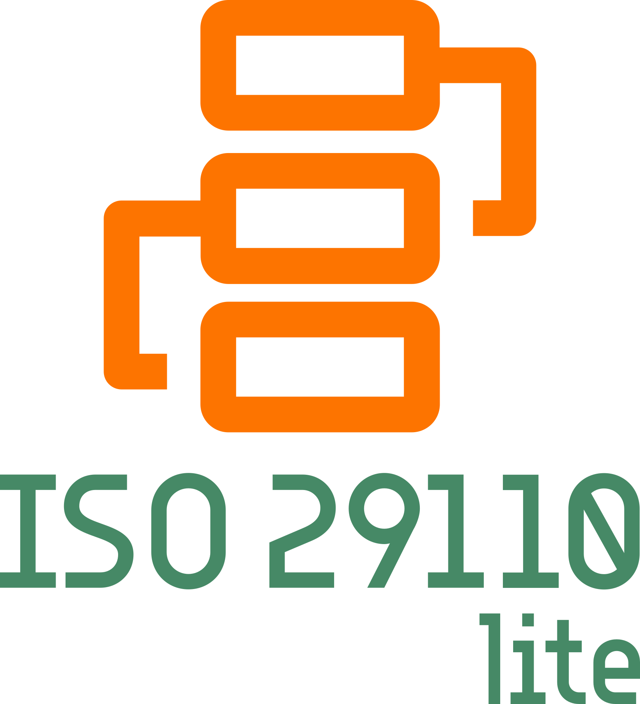

   

> 🚧 **ISO29110-Lite ainda está em fase de protótipo!**
> Esta versão está focada na **definição conceitual e estruturação inicial**. Algumas seções podem estar **incompletas ou em revisão**.  
> Funcionalidades, documentação detalhada e exemplos práticos ainda estão sendo desenvolvidos.  
>
>📌 Nesta fase, estamos estruturando:
>
> - 🏗 Conceitos e fundamentos globais
> - 📄 Documentação progressiva vinculada a este README
> - 🌍 Repositórios do ecossistema como protótipos
>

# ISO29110-Lite - _Implantação progressiva da norma ISO/IEC 29110_

**ISO29110-Lite** é um caminho estruturado para adoção progressiva da **ISO/IEC 29110**, mantendo compatibilidade total desde o início.

> **"Conceito modelado e compatível desde o início, complemento progressivo até à norma completa."**

O **ISO29110-Lite** é uma forma de garantir a adoção dos _conceitos_ da gestão de processos sem o impacto inicial das metodologias tradicionais. Ao invés de aprender tudo para depois implantar, um time aprende enquanto implanta. De forma progressiva mas nunca desalinhada da norma original.

🔎 Para mais detalhes, acesse **[Visão Geral do ISO29110-Lite](./docs/pt-br/philosophy/overview.md)**

O termo **_Lite_** não significa que seja uma versão reduzida ou simplificada da norma. Representa um modelo de implantação progressiva que garante que, mesmo incompleto, esteja alinhado à norma original.

🔎 Para mais detalhes, acesse **[Filosofia do ISO29110-Lite](./docs/pt-br/philosophy/philosophy.md)**

## Cenários de Uso: Como aplicar o ISO29110-Lite

O **ISO29110-Lite** pode ser adotado em diferentes contextos, dependendo das necessidades da empresa:

🔹 **Empresas buscando certificação**  
Empresas que desejam obter a certificação ISO29110 podem usar o Lite como um **passo preparatório**. Ele ajuda a estabelecer os conceitos fundamentais de gestão de processos antes da adoção formal do Guia de Implantação. Isso reduz a resistência à certificação e torna a transição mais eficiente.  
🔎 Consulte **[ISO29110-Lite para certificação](./docs/ptbr/use-cases/certification.md)**

🔹 **Empresas interessadas na cultura de processos**  
Nem todas as empresas precisam de certificação imediata, mas todas podem se beneficiar de uma gestão estruturada. O Lite permite que pequenas empresas adotem processos organizados sem a pressão da certificação, mantendo a compatibilidade caso desejem certificar-se no futuro.  
🔎 Consulte **[ISO29110-Lite para Cultura de Processos](./docs/ptbr/use-cases/process-culture.md)**

## Motivação

O **ISO29110-Lite** nasceu da necessidade de um modelo que conciliasse a **simplicidade inicial** com a **compatibilidade total ao ISO29110 original**. Ele foi idealizado para resolver a complexidade inicial de adoção completa da imediato.

Esta lacuna geram dois paradoxos principais:

🔧 **Na indústria**: Pequenos times ou projetos frequentemente ignoram metodologias robustas por serem excessivamente burocráticas. Quando crescem, enfrentam dificuldades em se alinhar a normas como o ISO/IEC 29110 devido à falta de padronização nos processos iniciais.

🎓 **Na academia e aprendizado prático**: Metodologias tradicionais exigem uma implementação rigorosa desde o início, o que afasta estudantes e novos profissionais de um aprendizado estruturado, deixando-os despreparados para cenários reais.

🔎 Para mais detalhes sobre as motivações e lacunas que levaram ao desenvolvimento do ISO29110-Lite, acesse **[Motivação do ISO29110-Lite](./docs/ptbr/philosophy/motivation.md)**.

## Referências e Influências do ISO29110-Lite

Embora o **ISO29110-Lite** tenha sido projetado para atender a necessidades específicas de empresas menores e projetos pequenos, sua filosofia é informada por várias metodologias e abordagens que orientam práticas progressivas, rastreáveis e simplificadas:

- **ISO29110 Original** - Estrutura e compatibilidade direta com os perfis da norma original.  
  🔗 [https://www.iso.org/standard/85338.html](https://www.iso.org/standard/85338.html)  

- **CMMI** - Foco na maturidade de processos e evolução progressiva, mas adaptado para escopos menores.  
  🔗 [https://cmmiinstitute.com/cmmi/intro](https://cmmiinstitute.com/cmmi/intro)  

- **Lean Thinking** - Eliminação de desperdício e ênfase no valor entregue ao longo do tempo.  
  🔗 [https://www.lean.org/](https://www.lean.org/)  

- **Agile** - Ciclos curtos de iteração e flexibilidade para adaptação em diferentes contextos.  
  🔗 [https://agilemanifesto.org/iso/ptbr/manifesto.html](https://agilemanifesto.org/iso/ptbr/manifesto.html)  

- **Composição e Herança no POO (Programação Orientada a Objetos)** - princípios presentes em composição e herança no POO estão presentes na filosofia do Lite foram inspiradas no conceito de hierarquias e métodos derivados
  🔗 [https://pt.wikipedia.org/wiki/Programação_orientada_a_objetos](https://pt.wikipedia.org/wiki/Programa%C3%A7%C3%A3o_orientada_a_objetos#Composi%C3%A7%C3%A3o,_heran%C3%A7a_e_delega%C3%A7%C3%A3o)  

- **Simplicidade e Minimalismo** - Abordagem similar ao **KISS (Keep It Simple, Stupid)** e **YAGNI (You Aren’t Gonna Need It)**, que busca implementar apenas o necessário no momento, permitindo expansão conforme as necessidades crescem.  
  🔗 [https://en.wikipedia.org/wiki/KISS_principle](https://en.wikipedia.org/wiki/KISS_principle)  

🔎 Para mais detalhes e uma análise comparativa entre o ISO29110-Lite e outras metodologias, consulte **[Comparação do Lite com outras abordagens](./docs/ptbr/philosophy/comparison.md)**

## **Como Funciona?**

O **ISO29110-Lite** opera com base em regras progressivas que permitem a sau adoção sem perder a rastreabilidade ou a compatibilidade com a norma original. Todo o funcionamento é guiado por um conjunto de diretrizes estabelecidas neste repositório, garantindo sua estrutura inicial de adoção.

Para isso, utiliza uma abordagem modular para a **documentação** e o **controle de qualidade**, com base em dois tipos de documentos:

- **POPs (Procedimentos Operacionais Padrão)**: Descrevem as **tarefas e subtarefas** necessárias para a execução de um processo. Cada POP contém instruções detalhadas que garantem que todos os envolvidos no projeto sigam as mesmas etapas para garantir a consistência.
  
- **DOCs (Documentos de Controle)**: Complementam os POPs ao definir **limites, critérios e padrões de controle** para garantir que o processo descrito nos POPs seja executado com **qualidade** e **conformidade**. Os DOCs também asseguram que cada processo seja monitorado e auditado corretamente.

🔎 Para mais detalhes sobre este sistema de documentos, consulte [O Sistema de POPs e DOCs](./docs/pt-br/Pops_and_Docs.md).

A partir destas diretrizes, um **POP-000 padrão** define como outros POPs devem ser criados e documentados, garantindo consistência e compatibilidade, juntamente com o  **DOC-000 padrão**, que orienta os aspectos de variações, subPOPs e integração.

A partir dessas regras e documentos, é possível estruturar processos de forma simplificada mas robusta garantindo uma preocupação central deste e dos projetos do ecossistema **FlowED**:

>**"Conceito modelado desde o início, eficiência progressiva por aprendizado próprio."**

🔎 Para mais detalhes, consulte **[Estrutura de Documentação](./docs/ptbr/structure.md)**

## Cenários de Uso

O **ISO29110-Lite** pode ser adotado em diferentes contextos, dependendo das necessidades da empresa:

🔹 **Cenário 1 - Empresas buscando certificação**  
Empresas que desejam obter a certificação ISO29110 podem usar o Lite como um **passo preparatório**. Ele ajuda a estabelecer os conceitos fundamentais de gestão de processos antes da adoção formal do Guia de Implantação. Isso reduz a resistência à certificação e torna a transição mais eficiente.  
🔎 Consulte **[ISO29110-Lite para certificação](./docs/ptbr/use-cases/certification.md)**

🔹 **Cenário 2 - Empresas interessadas na cultura de processos**  
Nem todas as empresas precisam de certificação imediata, mas todas podem se beneficiar de uma gestão estruturada. O Lite permite que pequenas empresas adotem processos organizados sem a pressão da certificação, mantendo a compatibilidade caso desejem certificar-se no futuro.  
🔎 Consulte **[ISO29110-Lite para Cultura de Processos](./docs/ptbr/use-cases/process-culture.md)**

## Uso Combinado com FlowED

O **ISO29110-Lite** originalmente foi criado para compor o ecossistema do [**FlowED**](https://github.com/SysDevTools/FlowED), uma metodologia progressiva de gestão de projetos. Assim, fornece a ele **POPs** e **DOCs** que documentam os processos nos diferentes ciclos do projeto, como **desenvolvimento**, **homologação** e **publicação**. A combinação dos dois sistemas garante que os processos sigam os padrões de qualidade e conformidade conforme as boas práticas da **ISO/IEC 29110**.

> **Nota**: O **ISO29110-Lite** é também um projeto independente, podendo ser adotado sozinho, com ou sem o ecossistema do **FlowED**, podendo ser facilmente adaptado a outras metodologias.

🔎 Para uma explicação mais detalhada sobre como o **ISO29110-Lite** suporta os ciclos do **FlowED**, consulte o [documento completo sobre a integração](./docs/pt-br/ISO29110_FlowED_Integration.md).

## Por Onde Começar

O **ISO29110-Lite** oferece uma abordagem estruturada para adoção com mínima burocracia inicial. Ele pode ser adotado tanto manualmente quanto com o suporte de um **CLI automatizado** (em desenvolvimento).

Quem preferir a abordagem manual pode configurar e versionar os processos diretamente com os modelos fornecidos. Já quem optar pela automação poderá contar com um fluxo que garante rastreabilidade e compatibilidade com a norma original.

### 🔹 Adotação com o CLI (Automatização Recomendada)

Se estiver utilizando o **CLI ISO29110-Lite**, o sistema automatiza a criação e o gerenciamento dos POPs e da documentação:

✅ Cria um banco SQLite para armazenar POPs e garantir rastreabilidade.

✅ Permite importar/exportar POPs em JSON para edição manual.

✅ Facilita a criação de novos POPs com base no POP-000 padrão.

✅ Exporta documentação certificável diretamente em formatos como PDF e HTML.

🔎 Para mais detalhes sobre essa abordagem, consulte **[Uso do CLI ISO29110-Lite](./docs/ptbr/adoption/cli-usage.md)**

### 🔹 Configuração Manual

Caso prefira seguir o **ISO29110-Lite** sem automação, você pode implementar manualmente a estrutura de POPs e DOCs seguindo estas etapas:

1️⃣ Clonar os templates de POP e DOC fornecidos neste repositório.

2️⃣ Preencher o POP-000 com as regras básicas para criação de novos POPs.

3️⃣ Criar novos POPs e DOCs alinhados às necessidades do time, mas seguindo as diretrizes do POP-000.

4️⃣ Versionar todos os documentos no Git para garantir rastreabilidade.

🔎 Para mais detalhes sobre essa abordagem, consulte **[Estrutura Manual do ISO29110-Lite](./docs/ptbr/adoption/manual-setup.md)**

Com essas opções, o **ISO29110-Lite** se adapta tanto a quem busca simplicidade inicial quanto a quem precisa de uma solução robusta e automatizada para gestão de processos. Escolha o caminho que melhor se adequa ao seu contexto e comece a evoluir progressivamente até a certificação completa!

## Contribuição

Para contribuir com o projeto, siga estas etapas:

1. Crie um fork do repositório.
2. Clone o seu fork para sua máquina local.
3. Crie uma branch para a sua contribuição.
4. Faça as alterações necessárias e commit.
5. Envie suas alterações para o seu fork.
6. Crie um Pull Request descrevendo suas alterações.

Para mais detalhes sobre como contribuir, consulte o [Guia de Contribuição](./docs/pt-br/guide.md).

---

## Contato

Para dúvidas ou sugestões, entre em contato através do email: <contato@flowed.org>

---

## Licença

Este projeto está licenciado sob a Licença MIT. Consulte o arquivo [LICENSE](./LICENSE) para mais detalhes.
