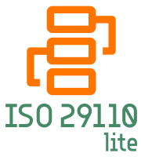

<p align="center">
  
</p>

> 🚧 **ISO29110-Lite ainda está em fase de protótipo!** 
> 
> Este projeto está na fase inicial, focado na **definição conceitual e estruturação progressiva**. Algumas seções podem estar **incompletas ou em revisão**.  
> A documentação, exemplos práticos e funcionalidades ainda estão em desenvolvimento.
>
>📌 Nesta fase, estamos estruturando:
>
> - 🏗 Conceitos e fundamentos globais
> - 📄 Documentação progressiva vinculada a este README

# ISO29110-Lite - _Gestão Progressiva de Projetos e Qualidade_

## intro


O **ISO29110-Lite** é um modelo de aprendizado [prático](./docs/pt-br/dictionary.md#prático) e [progressivo](./docs/pt-br/dictionary.md#progressividade) voltado para a internalização de conceitos de [gestão de projetos](./docs/pt-br/dictionary.md#gestão-de-projetos) (_ISO 29110_) e [controle da qualidade](./docs/pt-br/dictionary.md#controle-da-qualidade) (_ISO 9000_), priorizando o **autoaprendizado como meio de evolução e desenvolvimento da consciência crítica** sobre esses conceitos.  

Dessa forma, o **ISO29110-Lite** não substitui normas formais nem mesmo constitui um modelo de implantação. Seu foco está na absorção **gradual e consciente** das boas práticas, permitindo que equipes experimentem e adaptem seus processos sem comprometer a rastreabilidade. Embora a estrutura dos processos evolua organicamente, a documentação segue um formato padronizado desde o início, garantindo [rastreabilidade](./docs/pt-br/dictionary.md#rastreabilidade) e reaproveitamento futuro sem limitar a flexibilidade do aprendizado.  

Assim, não tem como propósito central a certificação ou a adoção formal de normas, mas pode ser utilizado como um passo preparatório para modelos de implantação, auxiliando equipes a desenvolverem maturidade e consciência crítica antes de processos de certificação ou implantação de normas específicas.

> 💡 "**Gestão e qualidade: Conceito antes da norma. Início padronizado, evolução autoaprendida.**"

🔎 Para mais detalhes, acesse **[Filosofia do ISO29110-Lite](./docs/pt-br/philosophy/philosophy.md)**

## **Motivação**  

A adoção de boas práticas em gestão de projetos e qualidade frequentemente se torna um processo de **adesão superficial e mecânica**, onde normas são aplicadas sem que seus conceitos sejam verdadeiramente compreendidos. Em um ambiente ideal, **a internalização dos princípios deveria preceder sua formalização**, garantindo que práticas estruturadas não sejam apenas regras a serem seguidas, mas sim reflexos de um conhecimento sólido e crítico.  

Esse cenário levanta um dilema: **normas rigorosas garantem rastreabilidade, mas sufocam o aprendizado**, enquanto abordagens flexíveis promovem adaptação, mas carecem de estrutura documental reaproveitável. O desafio está em equilibrar esses dois extremos, permitindo que equipes desenvolvam **autonomia e consciência crítica**, sem comprometer a rastreabilidade ou depender de suporte externo para interpretar o que deveria ser intuitivo.  

> 💡 **"Normas não são um fim, mas um reflexo do conhecimento. Sem aprendizado, a conformidade se torna apenas um ritual burocrático."**  

---

### 📌 O que uma metodologia deve buscar para ser eficaz

🧩 **A compreensão deve vir antes da padronização** → Um modelo de gestão eficaz não pode se basear apenas na adesão mecânica às normas. Os conceitos precisam ser internalizados de forma progressiva, garantindo que processos não sejam seguidos por imposição externa, mas porque fazem sentido para quem os aplica.

🧩 **A autonomia deve preceder a conformidade** → Se uma metodologia exige um especialista para ser interpretada e aplicada corretamente, ela não está promovendo autonomia. Um modelo eficaz deve garantir que as equipes tenham maturidade conceitual para analisar criticamente uma norma externa, sem depender de consultoria para validar cada decisão. A experiência consolidada das normas é valiosa, mas não pode anteceder a autonomia crítica necessária para avaliá-las e aplicá-las conscientemente.

🧩 **O aprendizado deve ser experimental, mas a rastreabilidade garantida** → Equipes precisam de liberdade para experimentar e adaptar suas práticas sem comprometer a documentação estruturada. Um processo que evolui organicamente não pode resultar na perda de informações ou na falta de rastreabilidade sobre o que foi aprendido e aprimorado ao longo do tempo.

🧩 **A estrutura inicial deve ser mínima, mas funcional** → Modelos tradicionais priorizam a adoção rápida de normas, muitas vezes ignorando a necessidade de uma base estruturada para experimentação. Uma abordagem eficaz deve oferecer um modelo de documentação que seja leve, mas suficiente para garantir organização e reaproveitamento futuro.

🧩 **A eficiência deve ser uma consequência, não um requisito** → Modelos rígidos exigem eficiência desde o início, enquanto abordagens sem estrutura deixam a otimização para um momento indefinido. No entanto, a eficiência sustentável só pode emergir naturalmente do aprendizado progressivo, e não como uma exigência prematura imposta antes que os conceitos sejam compreendidos.

> 💡 **"O aprendizado real acontece quando os processos fazem sentido para quem os executa. Sem essa compreensão, qualquer modelo se torna apenas um conjunto de regras a serem seguidas."**  

🔎 Para mais detalhes sobre as motivações do ISO29110-Lite, acesse **[Motivação do ISO29110-Lite](./docs/pt-br/philosophy/motivation.md)**

## Referências e Influências do ISO29110-Lite

O **ISO29110-Lite** foi desenvolvido com base nos **conceitos fundamentais da [gestão de projetos](./docs/pt-br/dictionary.md#gestão-de-projetos) e qualidade**, mas sem a rigidez das normas tradicionais. Ele combina essas referências com abordagens **práticas e progressivas**, permitindo que equipes adotem boas práticas sem uma transição abrupta.  

🔹 **[ISO/IEC 29110](https://www.iso.org/standard/85338.html)** → Norma voltada para pequenas organizações que buscam estruturar seus projetos de software. O **ISO29110-Lite** adota seus princípios, mas sem exigir conformidade formal.  

🔹 **[Guia de Implantação da ISO 29110](https://www.iso.org/standard/62790.html)** → Método oficial para implementação da **ISO 29110**. Diferente do **ISO29110-Lite**, ele fornece um conjunto de **procedimentos prontos**, mas permite que cada empresa defina seus próprios documentos.

### 📌 Diferença entre o **ISO29110-Lite** e o **Guia de Implantação**  

O **[Guia de Implantação](https://www.iso.org/standard/62790.html)** da **ISO29110** define **procedimentos prontos**, mas permite liberdade no formato da documentação. Já o **ISO29110-Lite** faz o contrário:  

🔹 **Impõe um formato documental rígido**, garantindo [rastreabilidade](./docs/pt-br/dictionary.md#rastreabilidade) desde o início.  
🔹 **Deixa que a equipe crie seus próprios procedimentos**, permitindo adaptação progressiva à realidade do time mas principalmente a adesão pela evolução empírica e autoaprendida.  

Essa abordagem torna o **ISO29110-Lite** um **passo intermediário** entre o uso informal de boas práticas e a certificação formal. Ele permite que equipes internalizem os princípios da **ISO 29110** sem uma mudança abrupta de cultura.  

🔹 **[ISO 9000](https://www.iso.org/standards/popular/iso-9000-family)** → Conjunto de normas para **gestão da qualidade** e melhoria contínua. No **ISO29110-Lite**, os conceitos de rastreabilidade e documentação estruturada são incorporados desde o início, mas sem processos rígidos.  

🔹 **[Lean Thinking](https://www.lean.org/)** → Redução da burocracia e foco no que realmente agrega valor. O **ISO29110-Lite** mantém apenas o essencial para a rastreabilidade e aprendizado.  

🔹 **[Agile](https://agilemanifesto.org/iso/ptbr/manifesto.html) e [Scrum](https://scrumguides.org/)** → O **ISO29110-Lite** se **alinha** ao **Agile** ao incentivar evolução progressiva, mas se **desalinha** na importância que dá para a documentação e entrega.  

🔹 **[KISS (Keep It Simple, Stupid)](https://en.wikipedia.org/wiki/KISS_principle) e [YAGNI (You Aren't Gonna Need It)](https://en.wikipedia.org/wiki/You_aren%27t_gonna_need_it)** → Princípios que influenciam a simplificação do **ISO29110-Lite**. Ele exige apenas o mínimo necessário para garantir rastreabilidade, sem criar sobrecarga documental.  

Dessa forma, o **ISO29110-Lite** não substitui normas nem impõe um novo modelo. Ele **cria um caminho acessível para que equipes aprendam e internalizem os conceitos fundamentais da gestão de projetos e qualidade, buscando ou não uma certificação formal**.  

💡 > **"Gestão e qualidade orgânica, indepentende, autônima e sustentável vem da consciência, mais do que em normas, mesmo as eficientes."**  

🔎 Para mais detalhes sobre a abordagem do projeto, acesse **[ISO29110-Lite Comparado](./docs/pt-br/philosophy/comparison.md)**

## Filosofia do ISO29110-Lite  

O **ISO29110-Lite** propõe um caminho alternativo às abordagens metodológicas tradicionais.  
**Em vez de impor processos prontos, ele permite que equipes desenvolvam seus próprios fluxos de trabalho**, evoluindo progressivamente pelo **autoaprendizado**, sem focar na eficiência imediata, mas sim na **adesão orgânica dos conceitos**.  

Essa abordagem reduz a complexidade inicial e torna a adoção das boas práticas um **processo empírico**. Mesmo que haja perdas de eficiência no início, a compreensão dos **conceitos** acontece de forma mais natural e consciente, garantindo aprendizado sustentável.  

### 📌 Princípios fudamentais do ISO29110-Lite  

O **ISO29110-Lite** não é uma implementação direta das normas _ISO 29110_ ou _ISO 9000_ e nem um modelo, estratégia ou processo de implementação, mas um modelo flexível que permite a internalização progressiva de seus **conceitos**. Ele possui três diferenciais essenciais:  

🔹 **Aprendizado antes da normalização** → O _Lite_ propõe que equipes experimentem, ajustem e internalizem conceitos antes de formalizá-los como forma de consciência analítica das normas ou procedimentos externos.  
🔹 **Adesão orgânica vs. eficiência imediata** → Em vez de seguir um modelo pronto e validado, como o **Guia de Implantação da ISO 29110**, o _Lite_ prioriza que equipes construam seus próprios processos e absorvam boas práticas de forma natural e acredita que, para isso, o melhor caminho seja o autoaprendizado, mesmo sabendo que ele tende a produzir normas menos eficientes.  
🔹 **Padronização documental obrigatória** → Diferente do **Guia de Implantação**, que permite liberdade na estrutura dos documentos, o _Lite_ exige um **formato fixo** desde o início. Isso garante **consistência, [rastreabilidade](./docs/pt-br/dictionary.md#rastreabilidade) e reaproveitamento futuro**, preparando o time para uma eventual certificação formal.  
🔹 **Abordagem Unificada e documentação inicial integrada** → O _Lite_ acredita que há menos dificuldade se os conceitos forem entendidos do mais genérico para o mais específico. Assim, inicia tratanto gstão de qualidade e de projetos de forma integrada e unificada. Acredita e proporciona que gradativamente os conceitos mais específicos sejam esclarescidos pela experiência empírica e autônoma. Essa abordagem torna o entendimento mais intuitivo e natural.  

💡 > **"_O Lite não substitui normas nem suas metodologias de implantação. Ele apresenta um caminho diferente, que pode até mesmo facilitar a formalização nelas._"**  

🔎 Para mais detalhes, consulte **[Filosofia do ISO29110-Lite](./docs/pt-br/philosophy/philosophy.md)**.  

## Como Funciona e por onde começar

Apesar de não impor processos de gestão do projeto, o **ISO29110-Lite** adota uma abordagem **padronizada e automatizada** para estruturá-los.  
Assim, impõe regras para a criação de procedimentos e determina a estrutura de formulação, apresentação, gestão e manipulação de documentos.
O funcionamento é baseado em **documentação modular** e é composto por quatro componentes principais:

🔹 **POPs (Procedimentos Operacionais Padrão)** → Definem **tarefas e subtarefas** necessárias para a execução de um processo. Tem formato, apresentação, composição e gestão padronizados.

🔹 **DOCs (Documentos de Controle)** → Complementam os POPs ao definir **critérios de qualidade e validação**, assegurando que os processos sejam auditáveis e passíveis de melhoria contínua.  

🔹 **ISOL (Ferramenta de Gestão de POPs, DOCs e NCs)** → Utilitário interativo para criação, gerenciamento e controle de documentos, além do registro e tratamento de **Não Conformidades (NCs)**.  

🔹 **Template de estruturação** → Fornece a base padronizada para documentação inicial, garantindo que os registros sigam um formato reutilizável e rastreável.  

💡 > **"_Estrutura mínima, rastreabilidade máxima. O Lite organiza o aprendizado e garante o reaproveitamento de informações, a partir de documentação estruturada desde o início._"**  

🔎 Para mais detalhes, consulte **[Estrutura de Documentação](./docs/pt-br/adoption/structure.md)**.  

---

### 📌 Estrutura e Categorização dos POPs  

Os **POPs** seguem um modelo estruturado, iniciando pela categorização dos **campos** disponíveis para alimentar os POPs.

🔹 **Os campos são categorizados em:**  

✅ **PM (Gerência de Projetos)** → Planejamento, rastreabilidade e acompanhamento.  
✅ **SI (Implementação de Software)** → Execução técnica, desenvolvimento e entregáveis.  
✅ **QA (Qualidade)** → Validação, auditoria e melhoria contínua.  

Apenas campos obrigatórios na estrutura mínima das normas é imposta. Porém, todos os campos das duas normas (**ISO/IEC 29110** e **ISO 9000**.) estarão disponíveis e podem ser adotados progressivamente.

💡 > **"A gestão de projetos e da qualidade encapsulados e integrados: a consciência, do geral ao específico, de forma natural"**.  

🔎 Para mais detalhes, consulte **[Estrutura de POPs e DOCs](./docs/pt-br/adoption/pop-structure.md)**.  

---

### 📌 Documentos Base: POP-000 e DOC-000  

Seguindo o princípio de gestao livre de processos mas rígida da documentação, dois documentos determinam a forma como procedimentos são criados:  

📌 **POP-000** → Define a estrutura mínima obrigatória de um Procedimento Operacional Padrão.  
📌 **DOC-000** → Estabelece critérios básicos para validação e controle dos processos documentados.  

💡 > **"No ISO29110-Lite, a única imposição é garantir a base para o autoconhecimento e rastreabilidade."**  

🔎 Para mais detalhes, consulte **[POP-000 e DOC-000](./docs/pt-br/adoption/pop-doc-base.md)**.  

---

### 📌 Iniciando com o _Template de Implementação_

Concluindo a padronização da gestão e da organização de documentos, o **ISO29110-Lite** fornece um template para estruturar a documentação do projeto.  

▶️ O template está disponível via **NPM** no endereço [https://www.npmjs.com/package/@sysdevtools/iso29110-lite-template](https://www.npmjs.com/package/@sysdevtools/iso29110-lite-template)

A instalaçao pode ser feita pelo comando:

```bash
npm install -g iso29110lite@template
```

Esse template inclui a estrutura de diretórios e arquivos necessários para a gestão da documentação.  

🔎 Para mais detalhes, consulte **[Documentação do ISO29110-Lite Template](./docs/pt-br/adoption/template-base.md)**.  

---

### 📌 Automação e Padronização com o ISOL  

O **ISOL** é um utilitário interativo desenvolvido em Vue.js de **arquivo único** (_single-file application_), responsável por toda a gestão da documentação.

🔹 **Principais funcionalidades:**  

✅ **Criação e preenchimento de POPs e DOCs** → Interface intuitiva para preenchimento guiado dos documentos.  
✅ **Controle de Não Conformidades (NCs)** → Registro automatizado e rastreável de NCs.  
✅ **Exportação estruturada** → Geração de versões em **HTML dinâmico** (wiki interativa) ou **PDFs formais**.  
✅ **Banco de Dados Local (SQLite)** → Armazena POPs, DOCs e NCs localmente, garantindo persistência e rastreabilidade.  
✅ **Rastreamento e versionamento** → Mantém histórico de revisões, garantindo que as atualizações sejam documentadas corretamente.  

💡 > **"No ISO29110-Lite, a automação não apenas simplifica o trabalho, mas garante rastreabilidade e conformidade contínua."**  

🔎 Para detalhes técnicos e como usar o ISOL, acesse **[Documentação do ISOL](./isol/README.md)**.  

## Integração com _FlowED_

O ISO29110-Lite faz parte de um ecossistema maior de ferramentas de desenvolvimento e gestão de projetos. Ele se integra perfeitamente ao [`FlowED`](https://github.com/SysDevTools/FlowED), um sistema de gestão de projetos com base na autoeducação.
Neste cenário, enquanto o `FlowED` gerencia o fluxo do projeto, o ISO29110-Lite fornece a gestão de procedimentos.

A documentação para o uso do ISO29110-Lite com o FlowED pode ser obtida diretamente no repositório do FlowED, onde é mantida.

🔎 Para mais detalhes sobre essa integração, consulte **[FlowED <-> ISO29110-Lite](https://github.com/SysDevTools/FlowED/blob/main/docs/pt-br/philosophy/iso29110-lite-alignment.md)** (link externo)

## Contribuição

Para contribuir com o projeto, siga estas etapas:

1. Crie um fork do repositório.
2. Clone o seu fork para sua máquina local.
3. Crie uma branch para a sua contribuição.
4. Faça as alterações necessárias e commit.
5. Envie suas alterações para o seu fork.
6. Crie um Pull Request descrevendo suas alterações.

Para mais detalhes sobre como contribuir, consulte o [Guia de Contribuição](./docs/pt-br/guide.md).

## Contato

Apesar de ser um projeto independente, o esforço de desenvolvimento deste projeto faz parte do Ecossistea do FlowED. Assim, para dúvidas ou sugestões, entre em contato através do email de contato do FlowED: <contato@flowed.info>

## Licença

Este projeto está licenciado sob a Licença MIT. Consulte o arquivo [LICENSE](./LICENSE) para mais detalhes.
